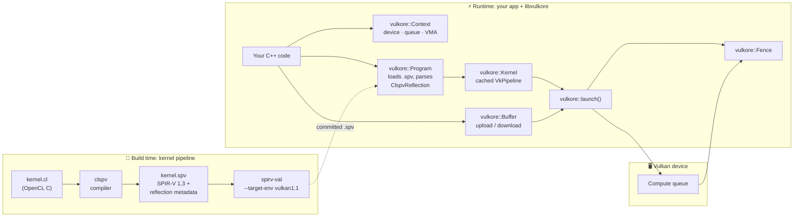
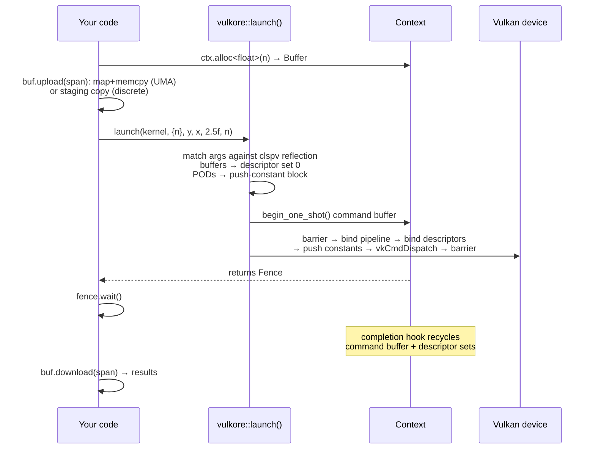
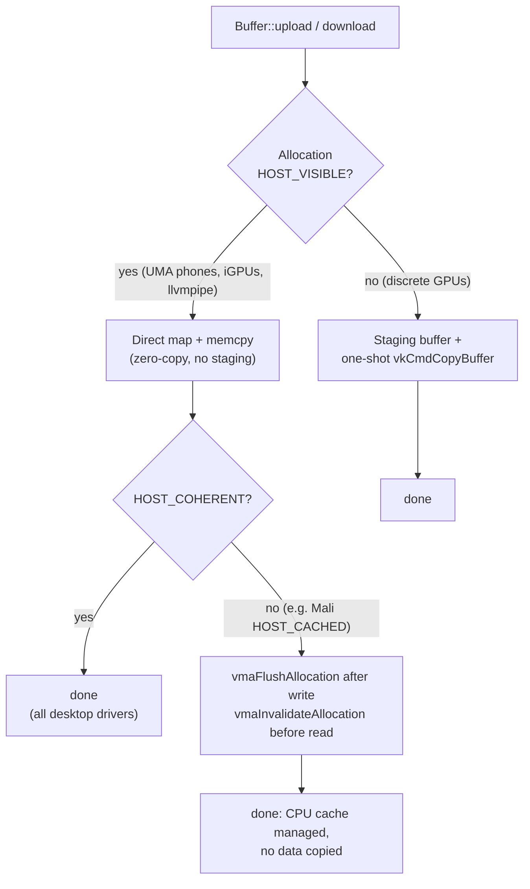

<div align="center">


# Vulkore

### CUDA-like GPU compute for Android phones in pure C/C++

**A slim Vulkan compute runtime with CUDA-inspired ergonomics. Write kernels in OpenCL C (pointers, structs, loops), compile them once to SPIR-V, and dispatch them with a one-liner: `vulkore::launch(kernel, grid, args...)`.**


**Android · Linux · Desktop GPUs (NVIDIA / AMD / Intel) · llvmpipe (CPU)**

**Runs Gemma 3 1B at ~60 tokens/sec on a phone GPU, and a 65,536-body simulation at 1801 GFLOP/s — from the same 1.7 MB runtime.**

</div>

---

## What is Vulkore?

Vulkore is a **pure C/C++ framework for running GPU compute kernels on Android (and desktop) with CUDA-like ergonomics**.

Modern phones ship serious GPUs, but there is no CUDA on Android. Your options today are raw Vulkan compute (hundreds of lines of boilerplate per dispatch, kernels in a shading language), or heavyweight wrappers that still make you think about descriptors and pipelines. Vulkore closes that gap:

- **Kernels are written in OpenCL C** (or C++ for OpenCL): real C with pointers, not a shading language.
- **Kernels are compiled at build time** by [google/clspv](https://github.com/google/clspv) into Vulkan-flavor (Shader) **SPIR-V** plus reflection metadata.
- **A slim C++20 Vulkan runtime** loads the `.spv`, maps kernel arguments to descriptor bindings automatically via clspv's reflection, and dispatches. Your host code is `launch(kernel, grid, args...)`, not 300 lines of `VkDescriptorSetLayoutBinding`.

> **Elevator pitch:** *"CUDA-inspired ergonomics, C kernels, runs on any Vulkan Android phone"*: [clvk](https://github.com/kpet/clvk)'s kernel language with [Kompute](https://github.com/KomputeProject/kompute)'s ergonomics, at a fraction of their footprint.

```cpp
// saxpy on the GPU, CUDA-style:
vulkore::Fence fence = vulkore::launch(saxpy, {n}, y, x, 2.5f, n);
fence.wait();

// Dispatch-heavy workloads: many kernels, ONE submit.
vulkore::Batch batch(ctx);
for (auto& layer : layers)
    batch.add(matvec, {rows}, layer.w, x, out, rows, cols);
batch.submit().wait();
```

No system Vulkan SDK required: headers are vendored and [volk](https://github.com/zeux/volk) loads `libvulkan.so` dynamically at runtime. It targets **Vulkan 1.1 / SPIR-V 1.3**, the baseline that modern Vulkan-capable Android devices meet.

## Why Vulkore?

Portability on mobile is not a checkbox. It's the hard part. Vulkore is built (and regression-tested on real hardware) around the traps that make "works on my desktop" compute code fail on phones:

- **Correct on non-coherent memory.** Desktop drivers always hand back `HOST_COHERENT` memory, so desktop-green test suites never exercise the cache-management path. Android GPUs (verified on Mali-G57) expose `HOST_CACHED` non-coherent memory. Vulkore's transfer strategy is keyed on *mappability, not coherency*: host-visible memory is mapped directly and copied with precise flush/invalidate, so transfers on unified-memory (UMA) phones are zero-copy with no staging. Staging-buffer copies are reserved for truly device-local memory on discrete GPUs.
- **Zero-boilerplate dispatch.** Argument binding, descriptor pools, pipeline creation, barriers between dispatches, and command-buffer recycling are all handled by the runtime, with compile-time `static_assert`s and named runtime errors when an argument doesn't match the kernel's signature.
- **CUDA semantics where it counts.** `Grid{x,y,z}` is *global thread counts* (rounded up to whole workgroups), `Context::wait_idle()` is your `cudaDeviceSynchronize`, and `launch()` returns a `Fence` you can wait on or let drain.

## What Vulkore runs

Three workloads, one runtime, all measured on a **OnePlus 15 (Snapdragon 8 Elite Gen 5, Adreno 840)** under Qualcomm's proprietary driver. Nothing in the runtime is specialised for any of them.

### An LLM: Gemma 3 1B, entirely on the phone GPU

| | |
| --- | --- |
| decode, shallow context | **70.9 tok/s** |
| decode, positions 128–4095 | **~60.6 tok/s, flat to within 6%** |
| model load | **1.9 s** (packed-weight cache) |
| context | 8192 tokens |
| dispatches per token | 838, in **one** `vkQueueSubmit` |

Same phone, same model, same int4 quantisation:

| Runtime | decode tok/s |
| --- | --- |
| **Vulkore** | **60.6 – 70.9** |
| Google LiteRT-LM (GPU) | 48 |
| llama.cpp OpenCL (Adreno) | 29.6 |
| llama.cpp CPU (4 threads) | 29.1 |

> LiteRT's figure is a single reading from their in-app benchmark at a context depth we could not control or record, and their UI exposes no curve, so read this as *comparable or better, and flat where theirs is unknown*, not as a fixed multiple. One more asterisk, ours: Vulkore re-quantises from a mixed-precision GGUF while LiteRT quantises once from fp32, so the bit width matches but fidelity may slightly favour LiteRT. Full method, caveats and the corrections we had to make to our own numbers: [`agent-docs/llm-on-vulkore.md`](agent-docs/llm-on-vulkore.md).

### Simulation: ten GPU workloads with measured load

**1801 GFLOP/s sustained.** N-body at 65,536 bodies is 4.29 billion interactions per frame. The same simulation on the CPU of the same phone is **404× slower**. A three-minute burn throttles gracefully (1779 → 1452 GFLOP/s, 37 °C → 47 °C).

FLOP counts for data-dependent kernels are *counted, not modelled*: an early version divided a worst-case model by real time and reported 40 TFLOP/s, which is physically impossible.

## Feature comparison

|                               | **Vulkore**            | clvk                 | Kompute            | Raw Vulkan       |
| ----------------------------- | -------------------- | -------------------- | ------------------ | ---------------- |
| Kernel language               | OpenCL C (real C)    | OpenCL C             | GLSL               | GLSL / HLSL      |
| Dispatch API                  | `launch(k, grid, args...)` | Full OpenCL API | Manager/Tensor ops | ~300 lines each  |
| Kernel compilation            | Build time (clspv)   | Runtime (clspv+LLVM) | Runtime (glslang)  | Offline          |
| Runtime footprint             | Slim static lib      | Ships LLVM           | Medium             | —                |
| Auto argument binding         | ✅ via reflection    | ✅                   | Manual tensors     | ❌ manual        |
| Non-coherent (mobile) memory  | ✅ tested on-device  | ✅                   | ⚠️                 | DIY              |
| System Vulkan SDK needed      | ❌ vendored + volk   | ✅                   | ✅                 | ✅               |

## Architecture

Two clean halves: an **offline kernel pipeline** (build time) and a **slim runtime** (your app).



### What happens on a `launch()`



### The portability core: memory transfers

The strategy that makes the same binary correct on a Mali phone, a desktop discrete GPU, and CPU llvmpipe:



> **Why this matters:** non-coherent memory means *manage the CPU cache*, not *copy the data*. Flush/invalidate are VMA no-ops on coherent memory, so the desktop cost is zero. The first real Mali-G57 run is exactly where 6 desktop-green transfer tests used to fail before this fix.

## Quick start

### 1. Clone (with submodules)

All third-party dependencies are vendored as git submodules; no system Vulkan SDK needed.

```bash
git clone --recursive https://github.com/badnikhil/vulkore.git
cd vulkore

# Or if you already cloned without --recursive:
git submodule update --init --recursive
```

### 2. Build & test

Requires CMake ≥ 3.20, Ninja, and a C++20 compiler (GCC or Clang).

```bash
cmake -S . -B build -G Ninja -DCMAKE_BUILD_TYPE=Release
cmake --build build
./build/tests/vulkore_tests
```

### 3. Test across devices

`VULKORE_DEVICE` selects a Vulkan device by case-insensitive name substring:

```bash
for d in llvmpipe RENOIR NVIDIA; do
  VULKORE_DEVICE=$d ./build/tests/vulkore_tests
done
```

### 4. Run on a real Android phone

The only way to exercise the non-coherent memory path is real hardware:

```bash
# Cross-compiles arm64 (needs ANDROID_NDK), pushes binary + kernels over adb,
# runs the full googletest suite on-device:
./scripts/run-android.sh --build
```

## Usage

```cpp
#include <vulkore/vulkore.hpp>
#include <vector>

int main() {
    // 1. Initialize a Context (picks a device automatically,
    //    or honor VULKORE_DEVICE=<name substring>)
    vulkore::Context ctx;

    // 2. Load a clspv-compiled program and grab a kernel
    vulkore::Program prog = vulkore::Program::from_file(ctx, "saxpy.spv");
    vulkore::Kernel saxpy = prog.kernel("saxpy");

    // 3. Allocate device buffers and upload data
    uint32_t n = 1024;
    std::vector<float> x_host(n, 1.0f);
    std::vector<float> y_host(n, 2.0f);

    vulkore::Buffer x = ctx.alloc<float>(n);
    vulkore::Buffer y = ctx.alloc<float>(n);
    x.upload(std::span(x_host));
    y.upload(std::span(y_host));

    // 4. Launch, CUDA style. Grid is GLOBAL thread count;
    //    buffers bind as storage buffers, PODs as push constants.
    vulkore::Fence fence = vulkore::launch(saxpy, {n}, y, x, 2.5f, n);
    fence.wait();

    // 5. Download results
    y.download(std::span(y_host));   // y = 2.5*x + y
    return 0;
}
```

And the kernel is just C:

```c
// saxpy.cl, compiled by clspv at build time
kernel void saxpy(global float* y, global const float* x,
                  float a, uint n) {
    uint i = get_global_id(0);
    if (i < n) y[i] = a * x[i] + y[i];
}
```

### The API at a glance

| Type | Header | What it does |
| --- | --- | --- |
| `vulkore::Context` | `context.hpp` | Owns instance, device, compute queue, VMA allocator, pools. Device policy: explicit index → `VULKORE_DEVICE` env → first discrete → integrated → anything with compute. |
| `vulkore::Buffer` | `buffer.hpp` | VMA-backed storage buffer. `upload()`/`download()` via `std::span`; `Usage::DeviceLocal` or `Usage::HostVisible`. |
| `vulkore::Program` / `Kernel` | `program.hpp` | Loads `.spv`, parses clspv reflection, lazily builds & caches compute pipelines. `kernel_names()` lists entry points. |
| `vulkore::launch()` | `launch.hpp` | Variadic dispatch. Compile-time rejection of raw pointers / oversized PODs; runtime errors name the mismatched argument. Returns a `Fence`. |
| `vulkore::Batch` | `launch.hpp` | Records **many dispatches into one command buffer and submits once**, preserving barriers. Essential when a workload is dispatch-heavy: an LLM token is 838 dispatches, and batching them is worth **11×**. |
| `vulkore::DescriptorCache` | `launch.hpp` | Optional, opt-in via `Batch(ctx, cache)`. Memoises descriptor sets on (layout, buffers); cut host recording cost 4.46 → 0.85 ms/token. |
| `vulkore::Fence` | `sync.hpp` | RAII `VkFence` with `wait(timeout)` and a completion hook that recycles command buffers & descriptor sets. |
| `vulkore::Error` / `XP_CHECK` | `check.hpp` | Exception-based error strategy; every Vulkan call is checked. |

### Kernel ABI (fixed by clspv flags)

Kernels are compiled with `-cl-std=CL3.0 -inline-entry-points -pod-pushconstant -uniform-workgroup-size -spv-version=1.3`:

- Buffer arguments → storage buffers at **descriptor set 0**, binding = argument order.
- POD arguments → tightly packed into **one push-constant block** (≤ 128 bytes).
- Default workgroup size **64×1×1** via spec constants, or a baked `reqd_work_group_size`; kernels must bounds-check.
- Unsupported features (images, samplers, printf, local pointers, …) fail loudly with `vulkore::Error` at program load.

## Project structure

```
vulkore/
├── include/vulkore/        # Public API headers
│   ├── vulkore.hpp         #   umbrella header
│   ├── context.hpp       #   device, queue, allocator
│   ├── buffer.hpp        #   storage buffers + transfers
│   ├── program.hpp       #   SPIR-V load + reflection
│   ├── launch.hpp        #   variadic CUDA-style dispatch
│   ├── sync.hpp          #   Fence
│   └── check.hpp         #   error handling
├── src/                  # Implementation (~1.3k LOC)
├── tests/                # googletest suite (91 tests, 8 TUs)
│   └── kernels/          # .cl fixtures + committed .spv + regenerate.py
├── scripts/
│   └── run-android.sh    # cross-build + adb push + on-device test run
└── third_party/          # Vendored submodules:
                          #   Vulkan-Headers, volk, VulkanMemoryAllocator,
                          #   googletest, clspv, SPIRV-Tools
                          #   (clvk & kompute vendored for reference only)
```

## Testing

**91 googletest cases** across contexts, buffers, programs, launches, batches, sync, and error paths, run against a device matrix (llvmpipe / AMD / NVIDIA) plus **on-device Android runs** via `scripts/run-android.sh`, which is the only environment that exercises the non-coherent memory path.

On the phone the LLM kernels carry their own gate: **38/38 `llm_phone_validation` on the Adreno 840** under Qualcomm's proprietary driver, with liveness proofs and negative controls, because a kernel here once compiled, passed `spirv-val`, bound, launched without error, and silently did not execute, reporting 40 TFLOP/s from stale counters. A clean compile proves nothing; only a verified output does.

> One finding worth repeating: **Mesa turnip is not a faithful *performance* proxy for Qualcomm's driver**, even where it is numerically identical. `softmax_rows` is 48% of attention cost on the Adreno 840 and 17% on turnip; profiling on the laptop would have optimised the wrong kernel.

Fixture kernels cover the interesting corners: 2-D dispatch (`transpose_2d`), IEEE edge cases (`compare_fp`: `-0.0 == +0.0`, `NaN != NaN`), baked workgroup sizes (`reqd_wgsize`), multi-entry-point modules (`two_kernels`), and mixed POD packing (`many_pod`). `tests/kernels/regenerate.py` rebuilds every `.spv` reproducibly with the exact clspv flags recorded in `tests/kernels/README.md`.

## Roadmap

- [x] **`vulkore::Batch`**: record many dispatches into one command buffer, one `vkQueueSubmit`. Worth 11× on an LLM token (838 dispatches), and a `DescriptorCache` cut host recording cost 4.46 → 0.85 ms.
- [x] **Local clspv build integration**: fixtures now compile with the in-tree clspv; no network, reproducible, and it verified 82/82 against locally regenerated `.spv`.
- [ ] Kernel fusion: ~35% of the GPU budget is now fixed per-dispatch cost (5.6 µs × 838), which makes fusion the largest remaining lever.
- [ ] Parallel prefill (currently decode-shaped, one position per pass)
- [ ] Persistent `VkPipelineCache` for faster startup
- [ ] Timeline semaphores (currently Fence-based by design)

## Acknowledgements

Third-party dependencies are vendored as git submodules under their own licenses. Vulkore stands on excellent open-source shoulders: [clspv](https://github.com/google/clspv), [volk](https://github.com/zeux/volk), [VulkanMemoryAllocator](https://github.com/GPUOpen-LibrariesAndSDKs/VulkanMemoryAllocator), [Vulkan-Headers](https://github.com/KhronosGroup/Vulkan-Headers), and [clvk](https://github.com/kpet/clvk) / [Kompute](https://github.com/KomputeProject/kompute) as reference designs.
